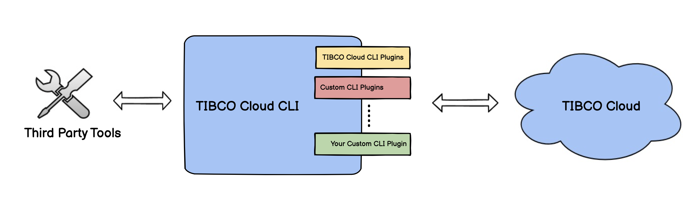
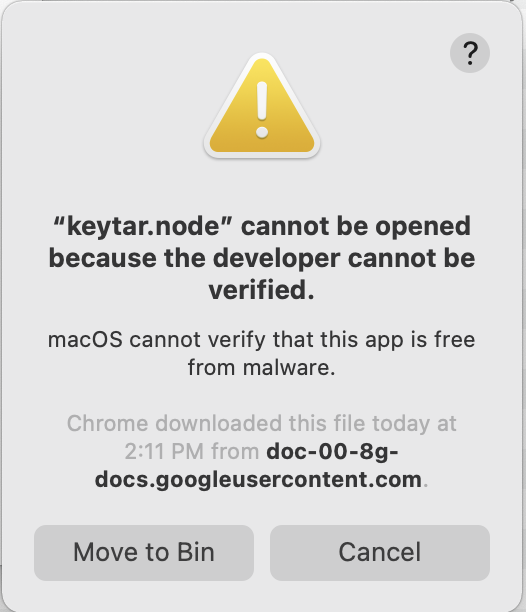
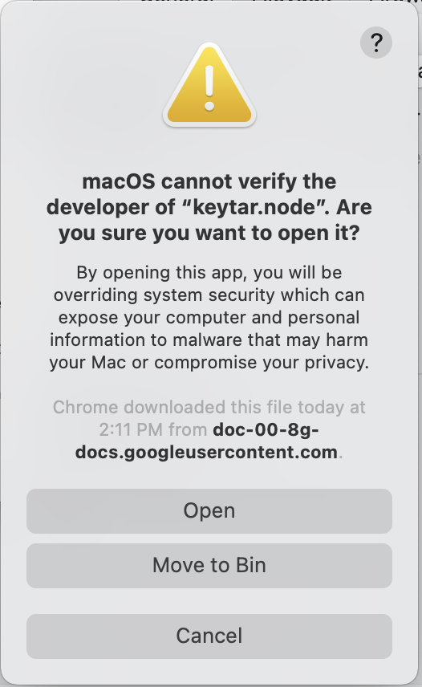
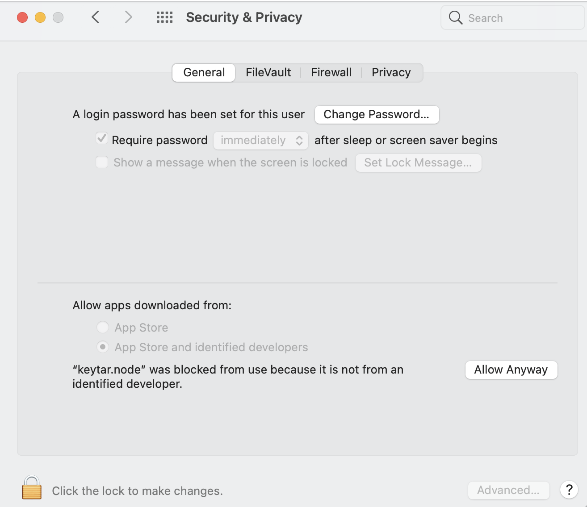

# TIBCO Cloud™ CLI

TIBCO Cloud™ CLI will help you to quickly interact with TIBCO Cloud™ capabilities and manage its resources from your machine. It will also help you to automate your tasks, manage local dev environments or can be a part of CI/CD pipeline.



This CLI can be extended by creating plugins. Checkout plugins developed by TIBCO - [Plugins Developed](#plugins-developed). \
You can also create custom CLI plugins for your use cases. For more details on developing plugins, see [Developers](#developers) section of the documentation.

## Table of Contents
1. [Installation](#installation)
    1.  [Prerequisites](#prerequisites)
    2.  [Builds](#builds)
    3. [Install using CLI](#install-using-cli)
    4. [Install manually](#install-manually)
    5. [Proxy Settings](#proxy)
    6. [Verify Installation](#verify-installation)
2.  [Command Format](#command-format)
3.  [Plugins](#plugins)
4.  [CLI configurations](#cli-configurations)
    1.  [Configure Profiles](#configure-profiles)
    2.  [Configure Plugins](#configure-plugins)
5.  [Common Command Flags](#common-command-flags)
6.  [Developers](#developers)
7.  [Known Issues](#known-issues)
8.  [Issues](#issues)
9.  [License](#license) 

## Installation

CLI is distributed using tarballs. Download tarball from below links based on your machine OS.

### Prerequisites

Should have libsecret installed for linux based machines. If not, use below commands -

- Debian/Ubuntu: `sudo apt-get install libsecret-1-dev`
- Red Hat-based: `sudo yum install libsecret-devel`
- Arch Linux: `sudo pacman -S libsecret`

### Builds


| OS        |     Build      |
| --------- | :-----------:  | 
| Windows   | [tibco-cli-win-x86.zip](https://github.com/TIBCOSoftware/cic-cli-main/releases/latest/download/tibco-cli-win-x86.zip)<br>[tibco-cli-win-x64.zip](https://github.com/TIBCOSoftware/cic-cli-main/releases/latest/download/tibco-cli-win-x64.zip) | 
| macOS     | [tibco-cli-mac-x64.tar.gz](https://github.com/TIBCOSoftware/cic-cli-main/releases/latest/download/tibco-cli-mac-x64.tar.gz)<br> [tibco-cli-mac-arm.tar.gz](https://github.com/TIBCOSoftware/cic-cli-main/releases/latest/download/tibco-cli-mac-arm.tar.gz)  |
| Linux   | [tibco-cli-linux-x64.tar.gz](https://github.com/TIBCOSoftware/cic-cli-main/releases/latest/download/tibco-cli-linux-x64.tar.gz)<br>[tibco-cli-linux-arm.tar.gz](https://github.com/TIBCOSoftware/cic-cli-main/releases/latest/download/tibco-cli-linux-arm.tar.gz)|

### Install using CLI

For **Linux and macOS**, run below command on your terminal

```bash
curl -sL https://github.com/TIBCOSoftware/cic-cli-main/releases/latest/download/install.sh | bash
```

For **Windows**, run below command on your Windows powershell

```ps
iex ((New-Object System.Net.WebClient).DownloadString('https://github.com/TIBCOSoftware/cic-cli-main/releases/latest/download/install.ps1'))
```

### Install Manually

#### For Linux and macOS

- Download archive from below link

  ```bash
  curl https://github.com/TIBCOSoftware/cic-cli-main/releases/latest/download/{build name from builds table} -fsSL -O
  ```

- Create a directory to keep installed CLI

  ```bash
  mkdir ~/tibco-cli
  ```

- Extract tar package to the created folder

  ```bash
  tar -xf <build file name> -C ~/tibco-cli --strip-components 1
  ```

- Set up envrionment variables for current terminal session

  ```bash
  export PATH=~/tibco-cli/bin:$PATH
  ```

  If you want to set environment variables permanently, find which shell is getting used

  ```bash
  echo $SHELL
  ```

  or

  ```bash
  ps -p $$
  ```

  As per your shell add these lines in your ~/.bashrc or ~/.zshrc file

  ```bash
  PATH=~/tibco-cli/bin:$PATH
  ```

##### For Windows


- Download archive from above [download table](#download) or using curl
- Extract the archive
- Set path variable to extracted folder's bin folder in environment variables
This can be done by navigating to `This PC -> Right click -> properties -> Adv System Settings -> Environment variables` \
OR  
`setx /M PATH "%PATH%;<CLI's bin folder's path>"`

### Proxy

In case your machine is behind proxy. Set proxy in environment variables

```bash
export http_proxy="http://PROXY_SERVER:PORT"
export https_proxy="https://PROXY_SERVER:PORT"
```

### Verify Installation

Try to run following command in your terminal

```bash
tibco --version
```

## Command Format

Commands can have either of the below formats

```
tibco <topic>:<command>  [flags] <args>
tibco <topic>:<command>   <args> [flags]
tibco <topic>:<sub-topic>:<command> [flags] <args>
```

For E.g:
```
tibco asyncapi:transform --to flogo --from ./myasyncapi.yml
```

Commands that interact with the same resources/assets are grouped together under a group name. Such groups are called topics. \
For E.g: config is a topic(group) that manages all CRUD operations on a config file.

```
tibco config:set
tibco config:add
tibco config:get
```

Topics can have sub topics too. \
E.g: On our TCI platform we have the capability of running Flogo apps or BusinessWork apps. Commands can be grouped together for each capabilities.
```
tibco tci:bw:do-something
tibco tci:flogo:add-trigger
```

Here `tci` is a topic, `flogo` is a subtopic and `add-trigger` is a command.

### Flags
For long flags use `--`  \
For short flags use `-`  \
Flags can be mentioned in multiple ways:
```
tibco apps:create --name myNodeJsAPP
tibco apps:create --name=myNodeJsAPP
tibco apps:create -n myNodeJsAPP
tibco apps:create -n=myNodeJsAPP --force
```
> **_NOTE:_** Values (true | false) should not be passed when flags are boolean. Parser will consider that true | false as command arguements. 

## Plugins

This CLI has a plugin-based architecture, that can be extended by creating plugins.\
Below are the commands for managing plugins - 
* [`tibco plugins`](./docs/plugins.md#tibco-plugins)
* [`tibco plugins:inspect PLUGIN...`](./docs/plugins.md#tibco-pluginsinspect-plugin)
* [`tibco plugins:install PLUGIN...`](./docs/plugins.md#tibco-pluginsinstall-plugin)
* [`tibco plugins:link PLUGIN`](./docs/plugins.md#tibco-pluginslink-plugin)
* [`tibco plugins:uninstall PLUGIN...`](./docs/plugins.md#tibco-pluginsuninstall-plugin)
* [`tibco plugins:update`](./docs/plugins.md#tibco-pluginsupdate)

#### Plugins developed
| Name                                                                                                | Description                                                                               |
|-----------------------------------------------------------------------------------------------------|-------------------------------------------------------------------------------------------|
| [cli-plugin-tcapim](https://github.com/TIBCOSoftware/tcapim-cli-plugin)     |  Plugin to create and manage TIBCO Cloud™ API Management applications. |
| [cli-plugin-tcam](https://github.com/TIBCOSoftware/cic-cli-plugin-tcam)  |  Plugin to provide you the ability to run basic commands for TIBCO Cloud API Modeler features.
| [cli-plugin-asyncapi](https://github.com/TIBCOSoftware/cic-cli-plugin-asyncapi) | Plugin to transform your AsyncAPI spec(2.1.0) into sample flogo template.|

## CLI Configurations

There are two types of configurations in the CLI. Profile configuration and Plugin configuration.

### Configure Profiles

Configure profiles so that you can interact with TIBCO Cloud.\
Start with the below command:

```bash
tibco profiles:initialize
```

This command will walk you through authentication process of the TIBCO Cloud and will generate default CLI profile.
Profile is a set of configurations grouped together. Currently **org** and **region** of the TIBCO Cloud are grouped together under a profile.This help commands to identify where to interact in the TIBCO Cloud.


Whenever command is executed, it will pick up the configuration(org & region) based on the profile mentioned in the command. If profile is not mentioned then it will fallback to the default profile.
Profiles can be mentioned as a command flag.
For e.g.: `tibco tcam:list-apis --profile eu-user`

You can add multiple profiles for different orgs and region using below command 
```
tibco profiles:add
```

Below are the list of commands to manage profiles in the CLI -
* [`tibco profiles:add`](./docs/profiles.md#tibco-profilesadd)
* [`tibco profiles:initialize`](./docs/profiles.md#tibco-profilesinitialize)
* [`tibco profiles:list`](./docs/profiles.md#tibco-profileslist)
* [`tibco profiles:refresh-token`](./docs/profiles.md#tibco-profilesrefresh-token)
* [`tibco profiles:remove [NAME]`](./docs/profiles.md#tibco-profilesremove-name)
* [`tibco profiles:set-default [NAME]`](./docs/profiles.md#tibco-profilesset-default-name)

> **_NOTE:_** Profiles are expired if not used in 14 days. If profile is expired, delete it and create new profile with same name.

### Configure Plugins

Some plugins and topics might also need persistent configurations. These configurations are maintained in `tibco-cli-config.ini` file. \
Every **section** and **subsection** of ini file represents configurations for **topics** and **subtopics** of the plugin respectively. Topics are set of commands grouped together in the plugin.  \
E.g: suppose we have a plugin for TIBCO Cloud Integration and it has three topics flogo, nodejs and businessworks
`tibco tci:flogo:<command>`  
`tibco tci:bw:<command>`  
`tibco tci:node:<command>`

Then `tibco-cli-config.ini` should look like below

```ini
[tci]
property=value # some tci level properties and values that may/ may not apply to flogo and bw

[tci.flogo] # subsection to maintain properties for flogo based commands
property=value
arr[]=1
arr[]=2


[tci.bw] # subsection to maintain properties for bw based commands
property=value

[tci.node] # subsection to maintain properties for bw based commands
property=value


[tcam] # section to maintain properties for tcam topic of tcam plugin
property=value

```

#### Files hierarchy

`tibco-cli-config.ini` can be at local and global level.  
Properties of local config file has a higher precendence over a global config file properties.  
Command will pick local config file by default if it is present in your current working directory with name as `tibco-cli-config.ini`.  \
You can also store local config file with different name and at different location.Then you can pass config file as a flag `--config $HOME/downloads/myconfig.ini` to the command.  
Local config file can be helpful in case any developer wants to share cli config file along with their project code.


Below are the list of commands to manage plugin configurations in the CLI -

* [`tibco config:get PROPERTY`](./docs/config.md#tibco-configget-property)
* [`tibco config:print`](./docs/config.md#tibco-configprint)
* [`tibco config:set PROPERTY VALUE`](./docs/config.md#tibco-configset-property-value)
* [`tibco config:unset PROPERTY`](./docs/config.md#tibco-configunset-property)

## Confidentials

Confidential data like tokens, refresh tokens and client secret are stored at:

- Keychain for macOS
- Credential vault for Windows
- Libsecret for Linux

## Common Command Flags

Common flags are availabe to most of the commands of CLI. \
They may be disabled for specific commands.

### --profile <string>

Use profile to quickly switch your configurations (Org or region).
If no profile mentioned then default profile is considered.\
For E.g:

```
tibco tci:show-apps --profile eu-user
```
### --config <string>

Path to the local config file if your cwd is not having `tibco-cli-config.ini` \
For E.g:

```
tibco asyncapi:transform --config $HOME/desktop/myconfig.ini
```

### --no-warnings

Disable warnings from command outputs.\
For E.g:

```
tibco asyncapi:transform --to flogo from ./spec.yml --no-warnings
```

### --help

See all flags and arguments for the corresponding command.
For E.g:

```
tibco asyncapi:transform --help
```

## Developers

- To create a CLI plugin checkout [oclif.io](https://oclif.io), since this CLI is based on oclif framework.
- [Build Plugins on TIBCO Cloud CLI](https://www.walkthrough.so/pblc/niqkfEnGwRZM/build-plugins-for-tibco-cloud-tm-cli?sn=0) will guide you to develop your first sample plugin.
- You will also need a [cli-core](https://github.com/TIBCOSoftware/cic-cli-core) package to get some features and utilities OOTB (it’s a must dependency).

## Known Issues

### For macOS

#### Issue
In case you get any of these below errors while running command `tibco profiles:initialize`





#### Solution
1. Navigate to the path `Apple menu -> System Preferences -> Security & Privacy -> General`.
2. Click on `Allow anyway` button.



## Issues

In case you find any issue, raise it here via the "Issues" tab of this GitHub repository.

## License

**BSD**
